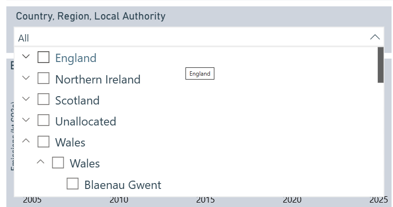
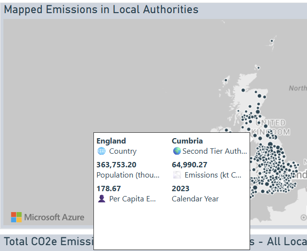
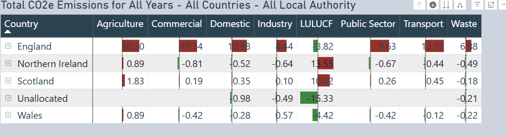
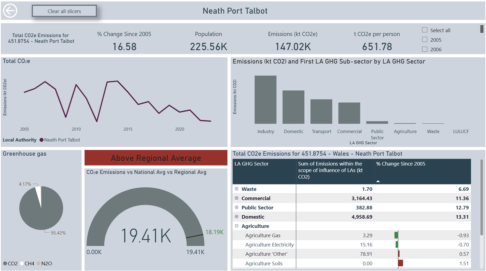
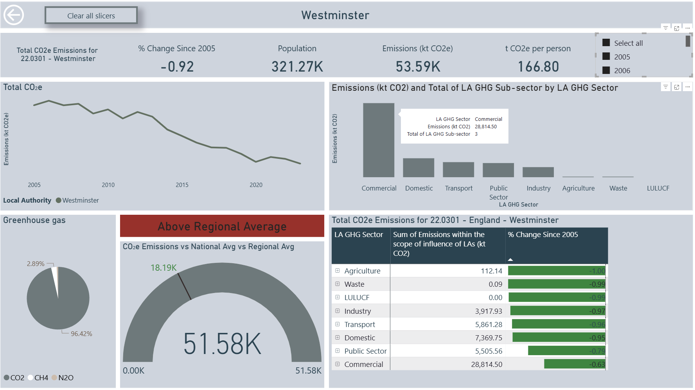
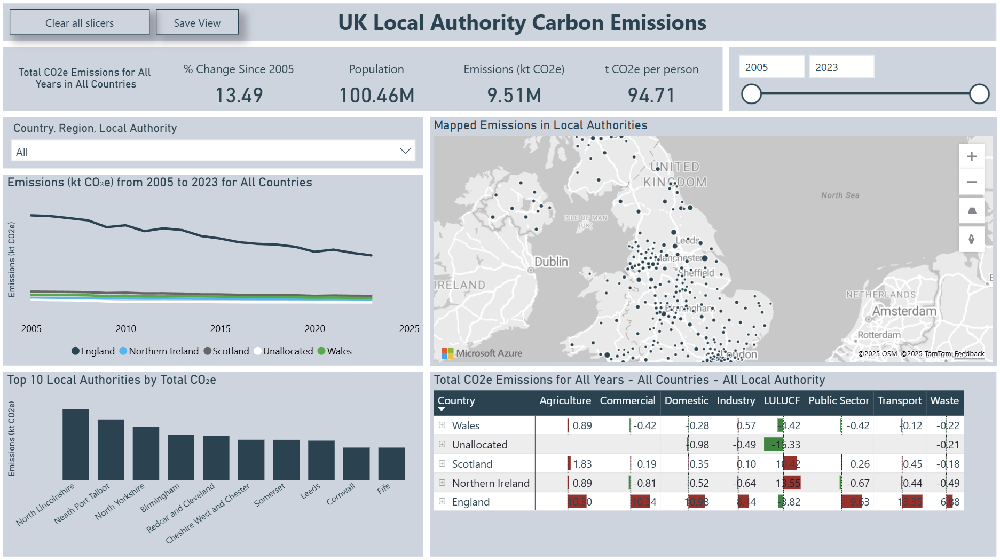

# UK Local Authority Carbon Emissions Dashboard

This Power BI dashboard presents CO₂e emissions across UK Local Authorities from 2005 to 2023. It enables stakeholders to explore and analyse emissions data with interactive visuals, filters, and insights by region, sector, and per capita emissions.

---

## Overview

This dashboard provides:

- Time-series trends of territorial emissions (kt CO₂e)
- Breakdown by sector (e.g. Transport, Domestic, Agriculture)
- Map visualisation of Local Authority data
- Comparison across Country, Region, and Local Authority levels
- Population and per capita emissions insights

---

##  Navigation and Interactivity

| Feature | Description |
|--------|-------------|
| 🧹 **Clear All Slicers** | Resets all filters to default view |
| 🔖 **Save View** (Bookmark Button) | Save and return to a custom filtered view |
| 📅 **Time Slider** | Select range from 2005 to 2023 |
| 🌍 **Map Tooltip** | Shows Local Authority names and CO₂e emissions interactively |
| 📊 **Dynamic Filtering** | All visuals update based on selected Country, Region, or Local Authority |

---

## Key Metrics

| Card | Description |
|------|-------------|
| **% Change Since 2005** | Overall emissions trend since baseline year |
| **Population** | Aggregated population of selected areas |
| **Emissions (kt CO₂e)** | Total CO₂e emissions |
| **t CO₂e per Person** | Emissions per capita (CO₂e ÷ Population) |

---

## Dynamic Titles

All titles update automatically to reflect current filters:

- **Line Chart**: `Emissions (kt CO₂e) from <Start Year> to <End Year> for <Selected Area>`
- **Bar Chart**: `Top 10 Local Authorities by Total CO₂e`
- **Map Title**: `Mapped Emissions for <Region>`
- **Data Table Title**: `Total CO₂e Emissions for <Country> – <Local Authority>`

> **Note:** Titles are powered by DAX using `SELECTEDVALUE`, `MIN/MAX`, and concatenation logic.

---

##  Bookmarks

- **"Save View"** button stores preferred filter states.
- Bookmarks include slicer selections and visible visuals.

---

## Design Features

- Light, accessible theme mimicking the stule of the [Office for National Statistics] (https://www.ons.gov.uk/)
- Grayscale map styling
- Consistent layout of KPIs and charts
- Emphasis on readability and clean visual structure

---

## Dataset Sources

-  ([UK Government Open Geography Portal](https://geoportal.statistics.gov.uk/datasets/ons::local-authority-districts-december-2024-boundaries-uk-bfc-2/explore?location=55.133586%2C-3.316939%2C6.82))

- [Local Authority GHG Emissions dataset (2005–2023)](https://www.data.gov.uk/dataset/723c243d-2f1a-4d27-8b61-cdb93e5b10ff/local_authority_carbon_dioxide_emissions/datafile/f043eef5-6144-4e02-ba7c-f38c9820ba13/preview)

---

## Developed With

- Microsoft Power BI Desktop
- DAX (Dynamic Analysis Expressions)
- GeoJSON/Map integration for spatial visuals

---

## Contact

For questions or enhancements, please contact the dashboard developer 
**Irina Yadrikova**

---
## KPI Cards (Top Summary Section)

**Description**: Displays high-level KPIs for the selected filters and time range:
- **% Change Since 2005**: Percentage change in emissions since the baseline year.
- **Population**: Total population covered by the current filters.
- **Emissions (kt CO2e)**: Total emissions in kilotonnes of CO2 equivalent.
- **t CO2e per person**: Emissions per capita.

**Features**:
- Auto-updates with slicer selections.
- Interactive slicer for year range updates all cards.

## Dropdown Filter (Country, Region, Local Authority)

**Description**: Allows filtering the data by hierarchical geography.

**Features**:
- Multi-level drillable filter (Country → Region → Local Authority).
- Affects all visual elements on the page for consistent data slicing.

## Line Chart (Emissions over Time)

**Description**: Time series trend showing total emissions (kt CO2e) from 2005 to 2023.

**Features**:
- Lines colored by country.
- Tooltip shows exact values for emissions and per capita emissions by year and country.

## Top 10 Local Authorities by CO2e (Bar Chart)

**Description**: Highlights the top 10 emitting Local Authorities based on selected filters.

**Features**:
- Vertical bar chart.
- Drill-through enabled to navigate to detailed Local Authority report.

## Map - Emissions in Local Authorities

**Description**: Interactive map displaying emissions at the Local Authority level.

**Features**:
- Azure Maps visual with custom tooltips:
  - Country, Second Tier Authority
  - Emissions, Population, Per Capita Emissions, Year
- Drill-through enabled from map points to detail page.
- Zoom and pan for better spatial focus.

## Emissions Table by Sector and Region

**Description**: Tabular breakdown of emissions by sectors (Agriculture, Commercial, Domestic, etc.) across regions/countries.

**Features**:
- Conditional formatting (color scales) for visual comparison.
- Expandable hierarchy to drill down from Country → Local Authority.

## Drill-through Detail Page (e.g. Dumfries and Galloway)

**Description**: Displays detailed emissions analysis for a single selected Local Authority.

**Features**:
- KPIs specific to the selected authority.
- Emissions by sector and sub-sector.
- Time series trend for the authority.
- Greenhouse gas composition pie chart.
- Accessible from any chart or map using right-click → Drill through.

## Benchmarking: CO₂e Emissions vs National & Regional Averages

**Description**:Compare one Local Authority's performance to regional and national averages. 

**Features**: 

- Dynamic Header Text: The title updates based on whether the selected Local Authority's emissions are Above or Below the Regional average.

- Driven by a DAX measure evaluating emissions against regional benchmarks.

- Gauge Visual:Displays Total Emissions (kt CO₂e) for the selected Local Authority; The black needle line shows the Regional average for comparison; Gauge max shows the National average.
- Use in conjunction with drill-through to view detailed breakdowns by sector for high-emitting authorities.
---
## Planned Enhancements

**Performance Optimisation**: Refine data model relationships, column/measure usage, and aggregation logic to reduce load times.

**More Dynamic Tooltips**: Include additional insights such as historical trends or average change over years in map/chart tooltips.

**Export Options**: Add better export functionalities (e.g., single-click image or PDF export of visuals).

## Potential New Features

**Forecasting Emissions**: Integrate time-series forecasting using historical trends and external drivers (e.g. economic growth, policy changes).

Sector Drilldowns: Allow users to click on a sector and drill into sub-sector emissions (e.g., Transport → Aviation, Road).

---

# Conclusion & Key Insights

The UK Local Authority Carbon Emissions dashboard offers several important insights based on the available dataset (2005–2023):

**Key Insights** 

National Decline in Emissions
Territorial CO₂e emissions have generally decreased across the UK, with some regions showing a greater reduction than others. This reflects both national policy efforts and local initiatives.

**Regional Variation**
Emissions levels and trends vary significantly by country, region, and local authority.

Industrial regions tend to show higher emissions and slower decline.

Urban areas with high populations tend to have higher per capita emissions, especially in transport and domestic sectors.

**Sector Differences**

Domestic and Transport are consistent contributors to CO₂e emissions across most authorities.

The LULUCF (Land Use, Land Use Change and Forestry) sector varies sharply between regions and can even show negative emissions in some cases.

**Per Capita Emissions**

Some smaller authorities show very high per capita emissions, often due to small populations and concentrated industrial activity.

Regions like Northern Ireland and Wales often show higher per capita emissions compared to England and Scotland.

**Top Contributors**

A small number of local authorities (e.g. North Lincolnshire, Birmingham) contribute a disproportionate share of total emissions.

These areas may require targeted interventions for emission reduction.
